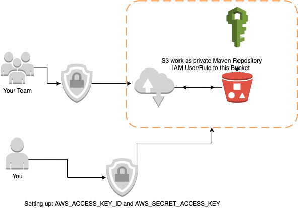

# maven-repository-aws-s3

**Introduction**
With the help of this plugin you can create your private Maven Repository with the essential features.
 


**Installation**


## Configure AWS Pre-Req


### Create IAM


### Create S3 Bucket


## Local PC Setup
If you plane to deploy you project jar from your local machine you need to follow the following steps.

* on your local maven setup directory ```.m2``` add the following XML snaps in ```setting.xml```. 
you basically gave permission to maven to access the S3 bucket, to be able to push or pull the files. one for **snapshot** and one for **release**.

##### Note: create ```setting.xml``` if it's not exist in ```.m2``` directory
```xml
<settings>
  <servers>
    ...
    ...
    <server>
      <id>YOUR_BUCKET_NAME-snapshot</id>
      <username>AWS_ACCESS_KEY_ID</username>
      <password>AWS_SECRET_ACCESS_KEY</password>
      <configuration>
        <region>AWS_REGION</region>
        <publicRepository>false</publicRepository>
      </configuration>
    </server>
    <server>
      <id>YOUR_BUCKET_NAME-release</id>
      <username>AWS_ACCESS_KEY_ID</username>
      <password>AWS_SECRET_ACCESS_KEY</password>
      <configuration>
        <region>AWS_REGION</region>
        <publicRepository>false</publicRepository>
      </configuration>
    </server>
    ....
    ....
  </servers>
</settings>
```

* on your project ```pom.xml``` add the following xml to let maven **DOWNLOAD** your project artfacet from the maven-repo 
```xml
<repositories>
    <repository>
        <id>YOUR_BUCKET_NAME-snapshot</id>
        <url>s3://YOUR_BUCKET_NAME/snapshot</url>
    </repository>
    <repository>
        <id>YOUR_BUCKET_NAME-release</id>
        <url>s3://YOUR_BUCKET_NAME/release</url>
    </repository>
</repositories>

```
##### Note: make sure that```<id>YOUR_BUCKET_NAME-snapshot</id>``` and ```<id>YOUR_BUCKET_NAME-release</id>``` should be identical with your ```.m2/setting.xml``` ids

* The following xml is required if you want ,user be able to upload into maven repo., from its terminal or idea
on your project ```pom.xml``` add the following xml to let maven **UPLOAD** your project artfacet into the maven-repo 
```xml
<distributionManagement>
    <snapshotRepository>
        <id>YOUR_BUCKET_NAME-snapshot</id>
        <url>s3://YOUR_BUCKET_NAME/snapshot</url>
    </snapshotRepository>
    <repository>
        <id>YOUR_BUCKET_NAME-release</id>
        <url>s3://YOUR_BUCKET_NAME/release</url>
    </repository>
</distributionManagement>

```

And the most important one, add the following xml in your project ```pom.xml``` with in the ```<build>``` tag
```xml
<build>
...
    <extensions>
        <extension>
            <groupId>com.ehsaniara</groupId>
            <artifactId>maven-repository-aws-s3</artifactId>
            <version>1.2.3</version>
        </extension>
    </extensions>
...
</build>
```

for Example:
```xml
<build>
    <plugins>
        <plugin>
            <groupId>org.springframework.boot</groupId>
            <artifactId>spring-boot-maven-plugin</artifactId>
            <executions>
                <execution>
                    <goals>
                        <goal>build-info</goal>
                    </goals>
                </execution>
            </executions>
        </plugin>
        <plugin>
            <groupId>org.apache.maven.plugins</groupId>
            <artifactId>maven-compiler-plugin</artifactId>
            <version>3.8.1</version>
            <configuration>
                <release>11</release>
            </configuration>
        </plugin>
    </plugins>
<span style="background-color: #FFFF00">
<extensions>
        <extension>
            <groupId>com.ehsaniara</groupId>
            <artifactId>maven-repository-aws-s3</artifactId>
            <version>1.2.3</version>
        </extension>
    </extensions>
</span>
    
</build>
```


## CI/CD Pipeline Setup
