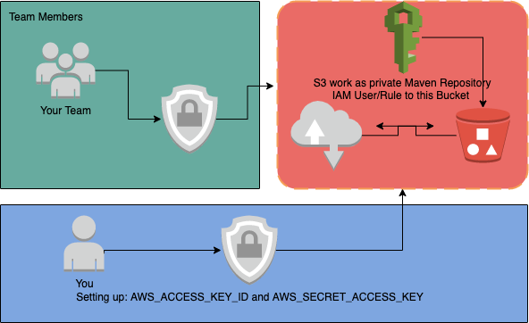

# maven-repository-aws-s3


**Introduction**
With the help of this maven-plugin you can create your own private Maven Repository with the essential features. There are many commercial products out there, for example: [Nexus](https://help.sonatype.com/repomanager3/formats/maven-repositories), [JFrog](https://jfrog.com/artifactory/) and ets.., but the drawback is they required more resources (Compute and storage) and some are costly. Where you can simply setup in your AWS cloud with much much less cost.
 


**Installation**

* [Configure AWS Pre-Req](#Configure-AWS-Pre-Req)
* [Configure By AWS CLI (No ready yet)](#Configure-By-AWS-CLI)
* [Configure By AWS Console](#Configure-By-AWS-Console)
*   [Create S3 Bucket](#Create-S3-Bucket)


<a name="Configure-AWS-Pre-Req"></a>
## Configure AWS Pre-Req
First thing first, I assume you already have AWS account and with (Preferably Admin permission) permission to create IAM User, -Rule and -Policy.

You can use both AWS-CLI or Web Console (browser: https://aws.amazon.com/)

<a name="Configure-By-AWS-CLI"></a>
## Configure By AWS CLI:

###### Note: make sure that you have latest AWS CLI installed in your PC.
###### Note: make sure that you are in your project root directory and have permission to create a file.

```shell script
curl -s https://raw.githubusercontent.com/ehsaniara/maven-repository-aws-s3/master/aws-s3-setup.sh | bash /dev/stdin bucket_name username
```
###### Note: AWS CLI script is not completed

<a name="Configure-By-AWS-Console"></a>
## Configure By AWS Console
(browser: https://aws.amazon.com/)

<a name="Create-S3-Bucket"></a>
### Create S3 Bucket

create a AWS S3 bucket, try to have unique name from you domain, for example: ```my-project-com-maven-repository```
###### Note: Block all public access on the bucket
and also create 2 folder of ```release``` and ```snapshot``` in it.

### Create Policy
Create policy with the following json (select json tab):

##### Note: dont forget to replace ```YOUR_BUCKET_NAME``` by your bucket name, for example: ```my-project-com-maven-repository```
```json
{
  "Version": "2012-10-17",
  "Statement": [
    {
      "Effect": "Allow",
      "Action": [
        "s3:PutObject",
        "s3:GetObject",
        "s3:ListBucket",
        "s3:DeleteObject"
      ],
      "Resource": "arn:aws:s3:::YOUR_BUCKET_NAME/*"
    }
  ]
}
```
then give name to this policy. something similar to your bucket name, for example: ```my-project-com-maven-repository-policy``` and then create the policy.


### Create IAM USER
on Add user, select a User name and make sure you have select the "Programmatic access"
then select "Attach existing policies directly", and in ```Filter policies``` box search for your the policy name you have just created.
then tag,review and create the user.

#### Important: Make sure that you have download the .csv file and store it in the secure place. the credentials in this file is required to user in your ```~/.m2/setting.xml``` file

create a user with (Programmatic access). 

* create separate user to access your S3 bucket, for the security reason you should not give admin permission. this user should have enough access to read and write in the bucket and no more than that.
#### Note: you can have as many user (per team member) or single user just for repo access.


## Local PC Setup
If you plane to deploy you project jar from your local machine you need to follow the following steps.

* on your local maven setup directory ```.m2``` add the following XML snaps in ```setting.xml```. 
you basically gave permission to maven to access the S3 bucket, to be able to push or pull the files. one for **snapshot** and one for **release**.

##### Note: create ```setting.xml``` if it's not exist in ```.m2``` directory
```xml
<settings>
  <servers>
    ...
    ...
    <server>
      <id>YOUR_BUCKET_NAME-snapshot</id>
      <username>AWS_ACCESS_KEY_ID</username>
      <password>AWS_SECRET_ACCESS_KEY</password>
      <configuration>
        <region>AWS_REGION</region>
        <publicRepository>false</publicRepository>
      </configuration>
    </server>
    <server>
      <id>YOUR_BUCKET_NAME-release</id>
      <username>AWS_ACCESS_KEY_ID</username>
      <password>AWS_SECRET_ACCESS_KEY</password>
      <configuration>
        <region>AWS_REGION</region>
        <publicRepository>false</publicRepository>
      </configuration>
    </server>
    ....
    ....
  </servers>
</settings>
```

* on your project ```pom.xml``` add the following xml to let maven **DOWNLOAD** your project artifactory from the maven-repo 
```xml
<repositories>
    <repository>
        <id>YOUR_BUCKET_NAME-snapshot</id>
        <url>s3://YOUR_BUCKET_NAME/snapshot</url>
    </repository>
    <repository>
        <id>YOUR_BUCKET_NAME-release</id>
        <url>s3://YOUR_BUCKET_NAME/release</url>
    </repository>
</repositories>

```
##### Note: make sure that```<id>YOUR_BUCKET_NAME-snapshot</id>``` and ```<id>YOUR_BUCKET_NAME-release</id>``` should be identical with your ```.m2/setting.xml``` ids

* The following xml is required if you want ,user be able to upload into maven repo., from its terminal or idea
on your project ```pom.xml``` add the following xml to let maven **UPLOAD** your project artifactory into the maven-repo 
```xml
<distributionManagement>
    <snapshotRepository>
        <id>YOUR_BUCKET_NAME-snapshot</id>
        <url>s3://YOUR_BUCKET_NAME/snapshot</url>
    </snapshotRepository>
    <repository>
        <id>YOUR_BUCKET_NAME-release</id>
        <url>s3://YOUR_BUCKET_NAME/release</url>
    </repository>
</distributionManagement>

```

And the most important one, add the following xml in your project ```pom.xml``` with in the ```<build>``` tag
```xml
<build>
...
    <extensions>
        <extension>
            <groupId>com.ehsaniara</groupId>
            <artifactId>maven-repository-aws-s3</artifactId>
            <version>1.2.3</version>
        </extension>
    </extensions>
...
</build>
```

for Example:
```xml
<build>
    <plugins>
        <plugin>
            <groupId>org.springframework.boot</groupId>
            <artifactId>spring-boot-maven-plugin</artifactId>
            <executions>
                <execution>
                    <goals>
                        <goal>build-info</goal>
                    </goals>
                </execution>
            </executions>
        </plugin>
        <plugin>
            <groupId>org.apache.maven.plugins</groupId>
            <artifactId>maven-compiler-plugin</artifactId>
            <version>3.8.1</version>
            <configuration>
                <release>11</release>
            </configuration>
        </plugin>
    </plugins>


    <extensions>
        <extension>
            <groupId>com.ehsaniara</groupId>
            <artifactId>maven-repository-aws-s3</artifactId>
            <version>1.2.3</version>
        </extension>
    </extensions>
    
</build>
```

once you have setup your pom.xml file in your project you can run the following line:

```shell script
# to clean your target directory
mvn clean
# deploy your artifactory into you maven-repo (AWS S3 Bucket)
mvn deploy
```


## CI/CD Pipeline Setup
[missing..]

## Reference

Apache wagon: http://maven.apache.org/wagon/
